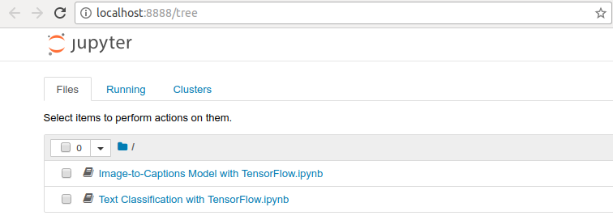
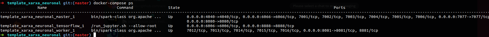
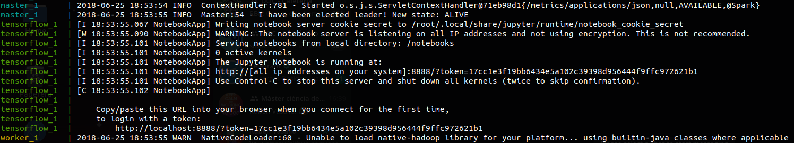
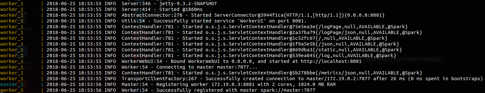

# Artificial neural network template


```
.
├── conf
├── data
├── notebooks
├── spark
├── tensorflow
└── docker-compose.yml
```

## Run:

```sh
$ docker-compose up
```

#### Enjoy ;-)



## Requirements:

* Docker
* Docker-compose

# ScreenShots

## Docker containers



## TensorFlow



## Spark



# TODO

* Implement ipyparallel https://github.com/ipython/ipyparallel with scale docker https://docs.docker.com/compose/reference/scale/